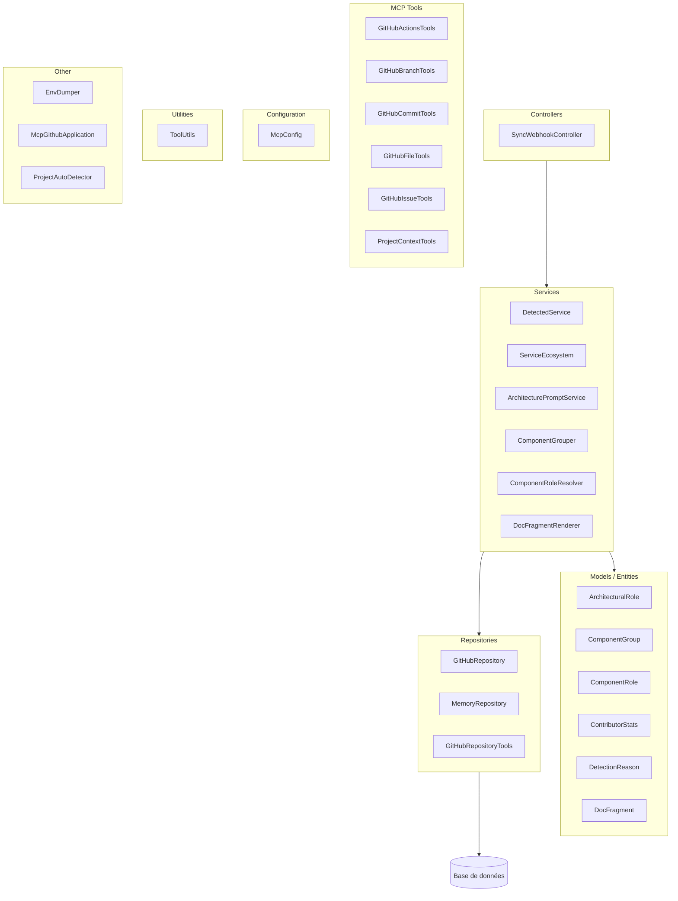
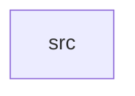

## Synthèse

**Dépôt :** `malekbelh/PFAProject` · **Branche :** `main` · **Fichiers :** 89

**Stack :** Java · Spring Boot · Maven

**Pattern :** MVC (Model-View-Controller) · **Confiance :** 90%

**Signaux détectés :**
- ✓ Controllers/ folder
- ✓ Services/ folder
- ✓ Models/Entities/ folder
- ✓ Repositories/ folder

**Recommandations :**
- No README.md found — consider adding one to document the project.

---

# Rapport Architecte Senior — `malekbelh/PFAProject`

| Champ | Valeur |
|-------|--------|
| Branche | `main` |
| Généré le | `2026-05-16` |
| Pattern détecté | MVC (Model-View-Controller) |
| Confiance | 90% |
| Total fichiers | 89 |

---

## 1. Résumé Exécutif

Ce dépôt implémente un projet **Java** utilisant **Spring Boot**.

L'architecture correspond au pattern **MVC (Model-View-Controller)** (confiance **90%**). Forte cohérence architecturale.

| Métrique | Valeur | Évaluation |
|---------|--------|------------|
| Total fichiers | 89 | |
| Fichiers source | 79 | |
| Fichiers test | 1 | 1% ratio |
| Confiance architecture | 90% | ✅ Élevée |

---

## 2. Stack Technologique

### Langages

| Langage | Nb fichiers | Rôle |
|---------|-------------|------|
| Java | 79 | Backend / côté serveur |

### Frameworks

#### Spring Boot

Auto-configuration + serveur embarqué.

### Build & Outils

- **Maven** — compile → test → package → install → deploy.

---

## 3. Matrice de Confiance des Patterns

| # | Pattern | Score | Barre | Signaux | Verdict |
|---|---------|-------|-------|---------|--------|
| 1 | MVC (Model-View-Controller) | 90% | `█████████░` | Controllers/ folder, Services/ folder, Models/Entities/ folder, Repositories/ folder | ✅ Match principal |
| 2 | Architecture en Couches | 60% | `██████░░░░` | Business/Service/ layer, Data/Persistence/ layer | ⚠️ Partiel |
| 3 | MVVM (Model-View-ViewModel) | 25% | `██░░░░░░░░` | Models/ folder | — Absent |
| 4 | Clean Architecture | 0% | `░░░░░░░░░░` | aucun | — Absent |
| 5 | Architecture Feature-Based / Modulaire | 0% | `░░░░░░░░░░` | aucun | — Absent |
| 6 | Architecture Hexagonale (Ports & Adapters) | 0% | `░░░░░░░░░░` | aucun | — Absent |
| 7 | Architecture Microservices | 0% | `░░░░░░░░░░` | aucun | — Absent |

---

## 4. Vues Architecturales (4+1)

### 4.1 Vue Logique



### 4.3 Vue Développement



---

## 5. Structure Complète

```
(root)/ (8 fichiers)
src/ (81 fichiers)
  ├── EnvDumper.java
  ├── main/java/com/example/mcp_github/McpGithubApplication.java
  ├── main/java/com/example/mcp_github/ProjectAutoDetector.java
  ├── main/java/com/example/mcp_github/config/McpConfig.java
  ├── main/java/com/example/mcp_github/controller/SyncWebhookController.java
  ├── main/java/com/example/mcp_github/model/ArchitecturalRole.java
  ├── main/java/com/example/mcp_github/model/ComponentGroup.java
  ├── main/java/com/example/mcp_github/model/ComponentRole.java
```

---

## 6. Catalogue des Composants

### Other (3)

| Classe | Responsabilité inférée |
|--------|------------------------|
| `EnvDumper` | Env Dumper |
| `McpGithubApplication` | Mcp Github Application |
| `ProjectAutoDetector` | Project Auto Detector |

### Configuration (1)

| Classe | Responsabilité inférée |
|--------|------------------------|
| `McpConfig` | Bean Spring ou configuration applicative |

### Controllers (1)

| Classe | Responsabilité inférée |
|--------|------------------------|
| `SyncWebhookController` | Point d'entrée HTTP — valider, déléguer au service |

### Models / Entities (25)

| Classe | Responsabilité inférée |
|--------|------------------------|
| `ArchitecturalRole` | Objet domaine — encapsule un concept métier |
| `ComponentGroup` | Objet domaine — encapsule un concept métier |
| `ComponentRole` | Objet domaine — encapsule un concept métier |
| `ContributorStats` | Objet domaine — encapsule un concept métier |
| `DetectionReason` | Objet domaine — encapsule un concept métier |
| `DocFragment` | Objet domaine — encapsule un concept métier |
| `DocSection` | Objet domaine — encapsule un concept métier |
| `GitHubBranch` | Objet domaine — encapsule un concept métier |
| `GitHubCollaborator` | Objet domaine — encapsule un concept métier |
| `GitHubCommit` | Objet domaine — encapsule un concept métier |
| `GitHubContent` | Objet domaine — encapsule un concept métier |
| `GitHubFork` | Objet domaine — encapsule un concept métier |
| `GitHubIssue` | Objet domaine — encapsule un concept métier |
| `GitHubPullRequest` | Objet domaine — encapsule un concept métier |
| `GitHubRelease` | Objet domaine — encapsule un concept métier |
| `GitHubSearchResult` | Objet domaine — encapsule un concept métier |
| `GitHubUser` | Objet domaine — encapsule un concept métier |
| `GitHubWorkflowRun` | Objet domaine — encapsule un concept métier |
| `GitHubWorkflowRunsResponse` | Objet domaine — encapsule un concept métier |
| `MemoryDocument` | Objet domaine — encapsule un concept métier |
| `MemoryEntity` | Objet domaine — encapsule un concept métier |
| `ProjectFingerprint` | Objet domaine — encapsule un concept métier |
| `ProvenanceLevel` | Objet domaine — encapsule un concept métier |
| `PublicMethod` | Objet domaine — encapsule un concept métier |
| `ReferenceArchitectures` | Objet domaine — encapsule un concept métier |

### Services (32)

| Classe | Responsabilité inférée |
|--------|------------------------|
| `DetectedService` | Logique métier — propriétaire de @Transactional |
| `ServiceEcosystem` | Logique métier — propriétaire de @Transactional |
| `ArchitecturePromptService` | Logique métier — propriétaire de @Transactional |
| `ComponentGrouper` | Logique métier — propriétaire de @Transactional |
| `ComponentRoleResolver` | Logique métier — propriétaire de @Transactional |
| `DocFragmentRenderer` | Logique métier — propriétaire de @Transactional |
| `DocumentationContextBuilder` | Logique métier — propriétaire de @Transactional |
| `DocumentationWriterService` | Logique métier — propriétaire de @Transactional |
| `GitHubFileTreeService` | Logique métier — propriétaire de @Transactional |
| `GitHubService` | Logique métier — propriétaire de @Transactional |
| `MemoryService` | Logique métier — propriétaire de @Transactional |
| `ProjectContextService` | Logique métier — propriétaire de @Transactional |
| `ProjectStructureAnalyzer` | Logique métier — propriétaire de @Transactional |
| `RolloDocsBuilder` | Logique métier — propriétaire de @Transactional |
| `ServiceDocGenerator` | Logique métier — propriétaire de @Transactional |
| `WorkspaceResolver` | Logique métier — propriétaire de @Transactional |
| `BasePatternDetector` | Logique métier — propriétaire de @Transactional |
| `CleanArchitectureDetector` | Logique métier — propriétaire de @Transactional |
| `FeatureBasedDetector` | Logique métier — propriétaire de @Transactional |
| `HexagonalDetector` | Logique métier — propriétaire de @Transactional |
| `LayeredDetector` | Logique métier — propriétaire de @Transactional |
| `MicroservicesDetector` | Logique métier — propriétaire de @Transactional |
| `MvcDetector` | Logique métier — propriétaire de @Transactional |
| `MvvmDetector` | Logique métier — propriétaire de @Transactional |
| `PatternDetector` | Logique métier — propriétaire de @Transactional |

### Repositories (3)

| Classe | Responsabilité inférée |
|--------|------------------------|
| `GitHubRepository` | Accès données — requêtes et persistance via ORM |
| `MemoryRepository` | Accès données — requêtes et persistance via ORM |
| `GitHubRepositoryTools` | Accès données — requêtes et persistance via ORM |

### Utilities (1)

| Classe | Responsabilité inférée |
|--------|------------------------|
| `ToolUtils` | Helper stateless — partagé entre les couches |

### MCP Tools (11)

| Classe | Responsabilité inférée |
|--------|------------------------|
| `GitHubActionsTools` | Tool IA exposé via Spring AI MCP |
| `GitHubBranchTools` | Tool IA exposé via Spring AI MCP |
| `GitHubCommitTools` | Tool IA exposé via Spring AI MCP |
| `GitHubFileTools` | Tool IA exposé via Spring AI MCP |
| `GitHubIssueTools` | Tool IA exposé via Spring AI MCP |
| `ProjectContextTools` | Tool IA exposé via Spring AI MCP |
| `GitHubReleaseTools` | Tool IA exposé via Spring AI MCP |
| `GitHubSocialTools` | Tool IA exposé via Spring AI MCP |
| `ProjectStructureTool` | Tool IA exposé via Spring AI MCP |
| `ReviewStructureTool` | Tool IA exposé via Spring AI MCP |
| `GitHubUserTools` | Tool IA exposé via Spring AI MCP |

### DTOs (1)

| Classe | Responsabilité inférée |
|--------|------------------------|
| `GitHubPullRequestTools` | Objet de transfert — contrat API requête/réponse |

### Tests (1)

| Classe | Responsabilité inférée |
|--------|------------------------|
| `McpGithubApplicationTests` | Suite de tests ou fixture |

---

## 7. Préoccupations Transversales

| Préoccupation | Statut | Constat | Recommandation |
|--------------|--------|---------|----------------|
| Logging | ✅ | Logger présent | Utiliser SLF4J + Logback. |
| Sécurité / Auth | ❌ | Pas d'auth | Ajouter spring-boot-starter-security + JWT. |
| Gestion erreurs | ⚠️ | Pas de handler global | @ControllerAdvice + RFC 7807 ProblemDetail. |
| Observabilité | ⚠️ | Pas d'observabilité | Ajouter Actuator + Micrometer. |

---

## 8. Couplage & Cohésion

### Taille des couches

| Couche | Fichiers | Risque |
|--------|----------|--------|
| Controllers | 1 | ✅ |
| Services | 30 | ✅ |
| Repositories | 2 | ✅ |
| Models / Entities | 28 | ✅ |

---

## 9. Tableau de Bord Qualité

| Signal | Statut | Constat | Action recommandée |
|--------|--------|---------|-------------------|
| Tests unitaires | ✅ | 1 fichiers — 1% | Maintenir ratio > 50% |
| Couche DTO | ⚠️ | Évite l'exposition des entités | Tous les endpoints doivent utiliser des DTOs |
| Handler d'exceptions global | ⚠️ | Centralise la gestion des erreurs | Implémenter @ControllerAdvice |
| README.md | ⚠️ | Onboarding développeur | Documenter la configuration locale |
| Pipeline CI/CD | ⚠️ | Build/test automatisé | Configurer un pipeline CI |
| Docker | ⚠️ | Runtime reproductible | Ajouter Dockerfile + docker-compose.yml |

---

## 10. Revue Sécurité

| Mécanisme | Détecté | Notes |
|-----------|---------|-------|
| Spring Security | ❌ | Ajouter spring-boot-starter-security |
| JWT | ⚠️ | Envisager JWT |

### Checklist Sécurité

- [ ] HTTPS forcé en production
- [ ] CORS configuré restrictivement
- [ ] Secrets dans les variables d'env
- [ ] Rate limiting sur les endpoints publics

---

## 11. Scalabilité & Performance

| Signal | Statut | Impact |
|--------|--------|--------|
| Async / MQ | ⚠️ | Allège les tâches lourdes |
| Cache | ✅ | Réduit la charge DB |
| Docker | ⚠️ | Permet le scaling horizontal |

---

## 12. Recommandations Stratégiques

### Critique (à corriger immédiatement)

- [ ] No README.md found — consider adding one to document the project.

### Spécificités Spring Boot

- [ ] `@ConfigurationProperties` + `@Validated` plutôt que `@Value`.
- [ ] `spring.jpa.open-in-view=false`.
- [ ] `@Transactional` uniquement sur la couche service.

---

## 13. Feuille de Route

| Phase | Horizon | Objectif | Livrables | Métrique |
|-------|---------|----------|-----------|----------|
| **1 — Stabiliser** | Semaine 1–2 | Combler les lacunes | README, tests, handler exceptions, DTOs | Build vert |
| **2 — Qualité** | Semaine 3–4 | Quality gate | CI/CD, OpenAPI, logging structuré | CI vert sur chaque PR |
| **3 — Observabilité** | Mois 2 | Prêt prod | Actuator, métriques, health probes | MTTR < 15 min |
| **4 — Scale** | Mois 3+ | Charge ×10 | Cache, async, optimisation DB | p99 < 200ms |

---

## 14. Architecture Decision Records (ADR)

### ADR-001 : Choix du Pattern Architectural

**Statut :** Accepté

**Décision :** Adopter **MVC (Model-View-Controller)**.

**Conséquences :** (+) Pattern bien compris. (-) Discipline requise.

### ADR-002 : Choix du Framework

**Décision :** Utiliser **Spring Boot**.

### ADR-003 : Stratégie de Tests

**Décision :** Pyramide : Unitaires (70%) + Intégration (20%) + Contrat (10%).


---

*Dernière mise à jour : 2026-05-16*


---
[💬 Discuter avec l'assistant IA sur ce projet](http://localhost:3000/?project_id=PFAProject)

