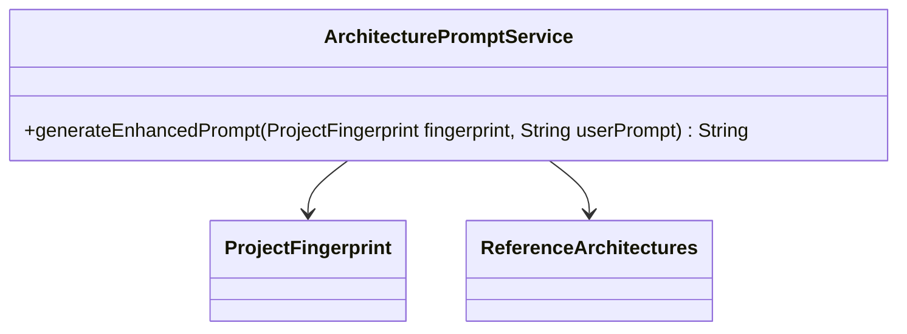

# Diagramme de classes

```mermaid
classDiagram
class ArchitecturePromptService {
  +generateEnhancedPrompt(ProjectFingerprint fingerprint, String userPrompt) String
}
ArchitecturePromptService --> ProjectFingerprint
ArchitecturePromptService --> ReferenceArchitectures
```

---
