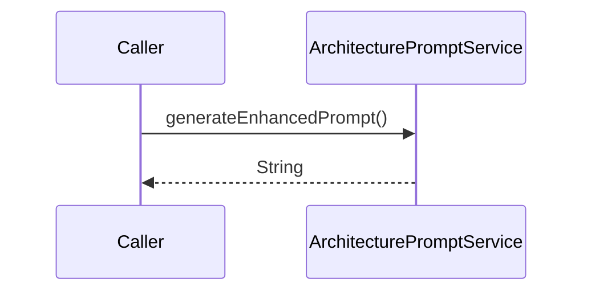

# Diagrammes de séquence

## `generateEnhancedPrompt`

```mermaid
sequenceDiagram
participant Caller
participant ArchitecturePromptService
Caller->>ArchitecturePromptService: generateEnhancedPrompt()
ArchitecturePromptService-->>Caller: String
```

 ⓘ *(static-analysis)*

---
*Généré par Antigravity MCP. Ne pas éditer manuellement.*