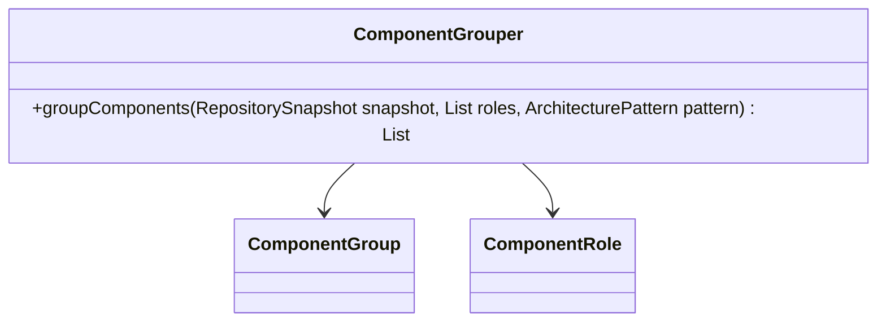

# Diagramme de classes

```mermaid
classDiagram
class ComponentGrouper {
  +groupComponents(RepositorySnapshot snapshot, List<ComponentRole> roles, ArchitecturePattern pattern) List<ComponentGroup>
}
ComponentGrouper --> ComponentGroup
ComponentGrouper --> ComponentRole
```

---
