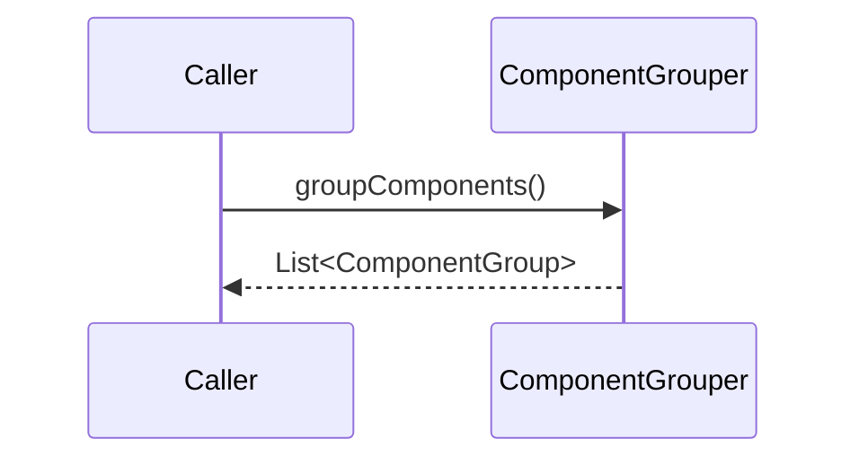

# Diagrammes de séquence

## `groupComponents`

```mermaid
sequenceDiagram
participant Caller
participant ComponentGrouper
Caller->>ComponentGrouper: groupComponents()
ComponentGrouper-->>Caller: List<ComponentGroup>
```

 ⓘ *(static-analysis)*

---
