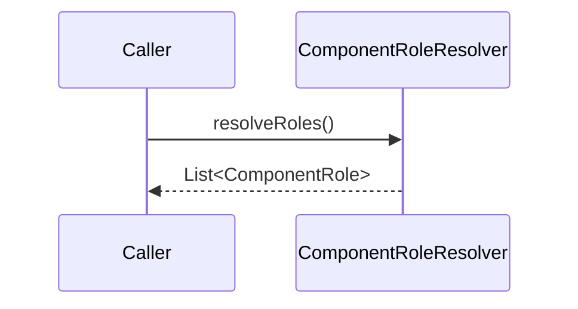

# Diagrammes de séquence

## `resolveRoles`

```mermaid
sequenceDiagram
participant Caller
participant ComponentRoleResolver
Caller->>ComponentRoleResolver: resolveRoles()
ComponentRoleResolver-->>Caller: List<ComponentRole>
```

 ⓘ *(static-analysis)*

---
*Généré par Antigravity MCP. Ne pas éditer manuellement.*