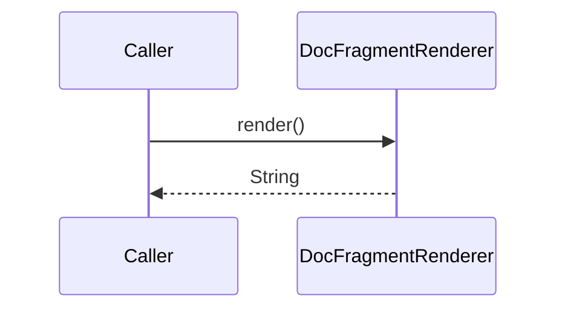

# Diagrammes de séquence

## `render`

```mermaid
sequenceDiagram
participant Caller
participant DocFragmentRenderer
Caller->>DocFragmentRenderer: render()
DocFragmentRenderer-->>Caller: String
```

 ⓘ *(static-analysis)*

---
*Généré par Antigravity MCP. Ne pas éditer manuellement.*