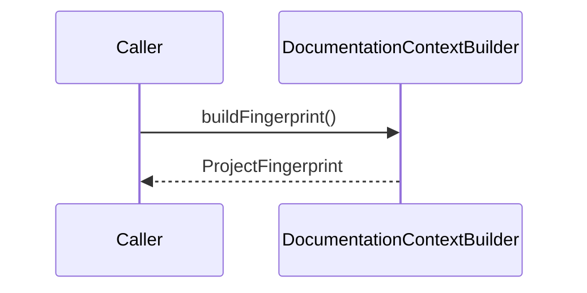
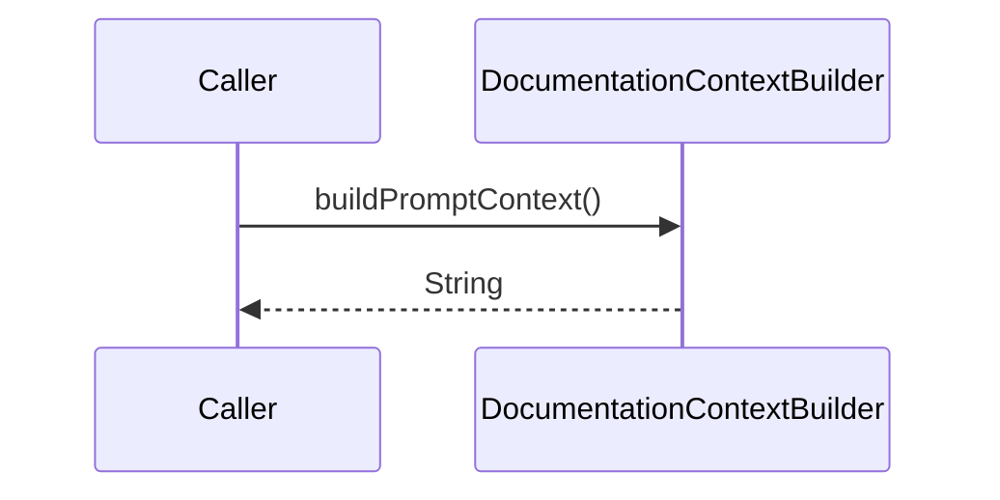

# Diagrammes de séquence

## `buildFingerprint`

```mermaid
sequenceDiagram
participant Caller
participant DocumentationContextBuilder
Caller->>DocumentationContextBuilder: buildFingerprint()
DocumentationContextBuilder-->>Caller: ProjectFingerprint
```

## `buildPromptContext`

```mermaid
sequenceDiagram
participant Caller
participant DocumentationContextBuilder
Caller->>DocumentationContextBuilder: buildPromptContext()
DocumentationContextBuilder-->>Caller: String
```

 ⓘ *(static-analysis)*

---
*Généré par Antigravity MCP. Ne pas éditer manuellement.*