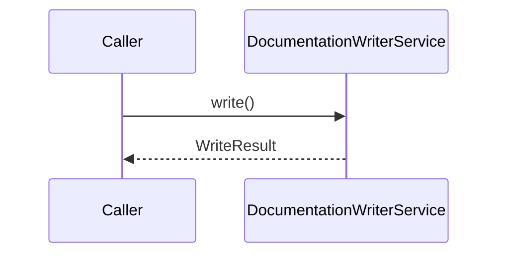
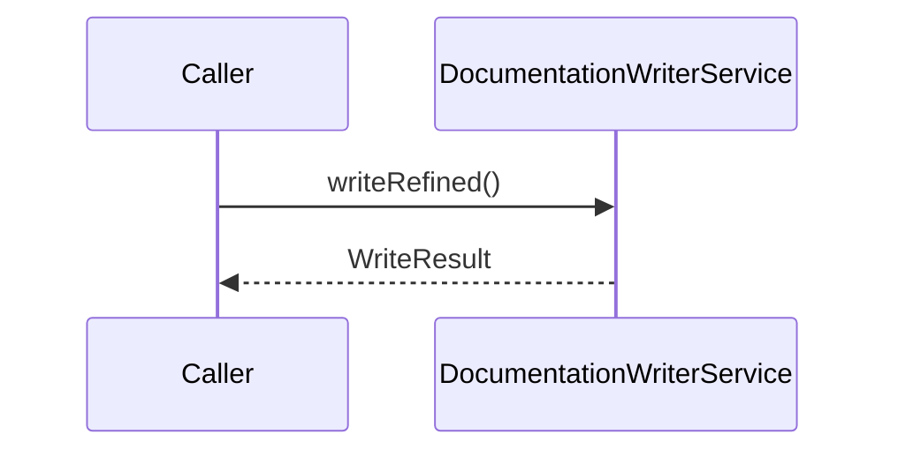
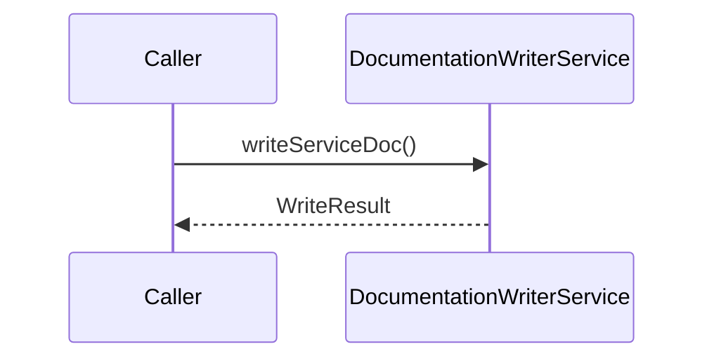
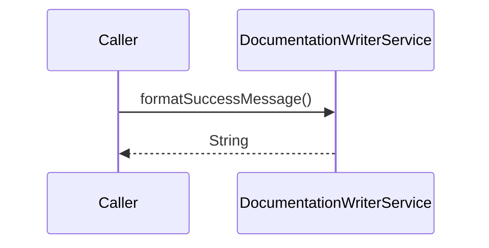
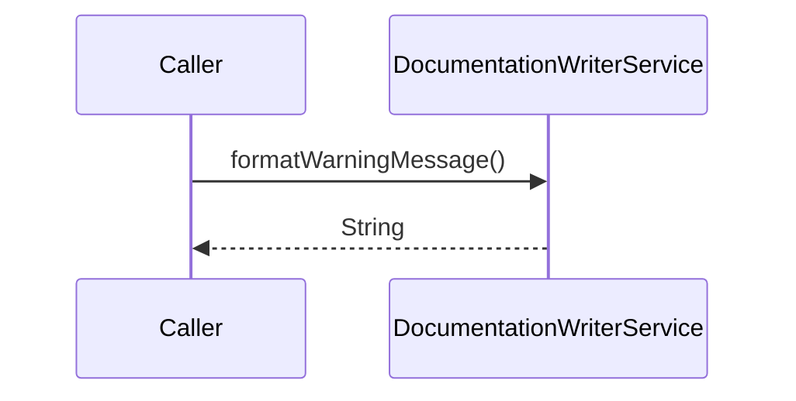

# Diagrammes de séquence

## `write`

## `writeRefined`

## `writeServiceDoc`

## `writeIndexDoc`

## `formatSuccessMessage`

## `formatWarningMessage`

 ⓘ *(static-analysis)*

---
*Généré par Antigravity MCP. Ne pas éditer manuellement.*