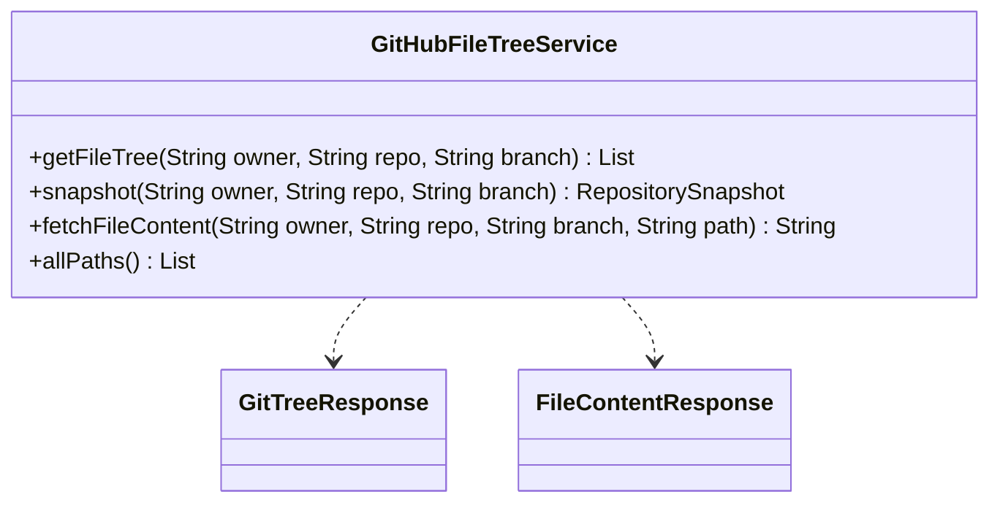

# Diagramme de classes

```mermaid
classDiagram
class GitHubFileTreeService {
  +getFileTree(String owner, String repo, String branch) List<TreeEntry>
  +snapshot(String owner, String repo, String branch) RepositorySnapshot
  +fetchFileContent(String owner, String repo, String branch, String path) String
  +allPaths() List<String>
}
GitHubFileTreeService ..> GitTreeResponse
GitHubFileTreeService ..> FileContentResponse
```

---
