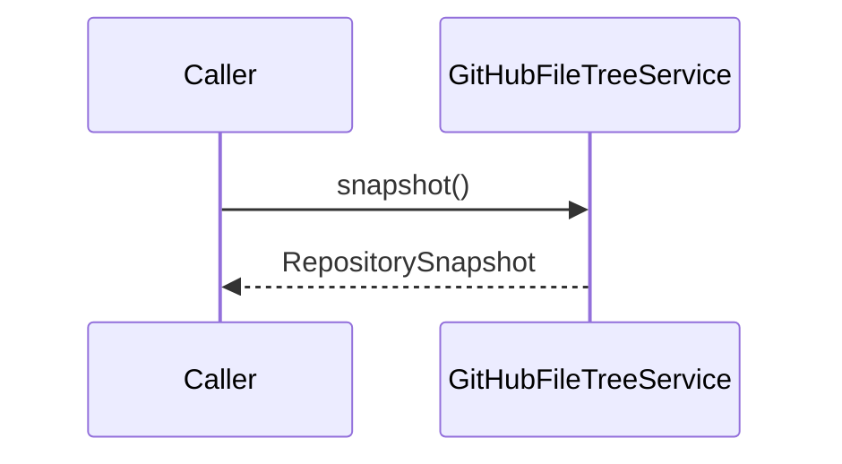
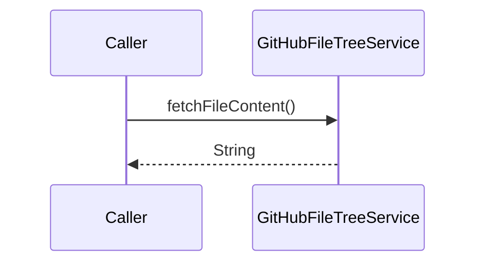
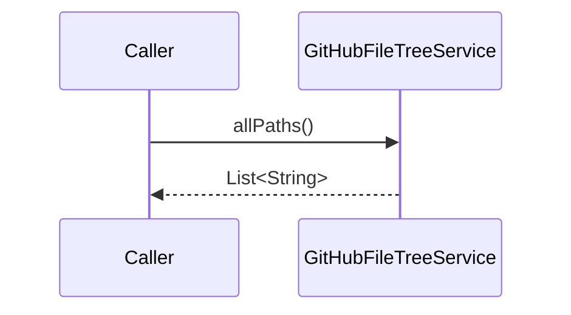

# Diagrammes de séquence

## `getFileTree`

```mermaid
sequenceDiagram
participant Caller
participant GitHubFileTreeService
Caller->>GitHubFileTreeService: getFileTree()
GitHubFileTreeService-->>Caller: List<TreeEntry>
```

## `snapshot`

```mermaid
sequenceDiagram
participant Caller
participant GitHubFileTreeService
Caller->>GitHubFileTreeService: snapshot()
GitHubFileTreeService-->>Caller: RepositorySnapshot
```

## `fetchFileContent`

```mermaid
sequenceDiagram
participant Caller
participant GitHubFileTreeService
Caller->>GitHubFileTreeService: fetchFileContent()
GitHubFileTreeService-->>Caller: String
```

## `allPaths`

```mermaid
sequenceDiagram
participant Caller
participant GitHubFileTreeService
Caller->>GitHubFileTreeService: allPaths()
GitHubFileTreeService-->>Caller: List<String>
```

 ⓘ *(static-analysis)*

---
