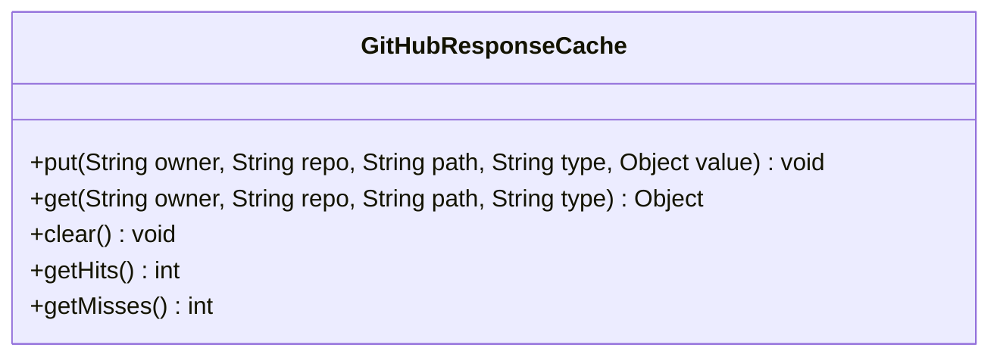

# Diagramme de classes

```mermaid
classDiagram
class GitHubResponseCache {
  +put(String owner, String repo, String path, String type, Object value) void
  +get(String owner, String repo, String path, String type) Object
  +clear() void
  +getHits() int
  +getMisses() int
}
```

---
