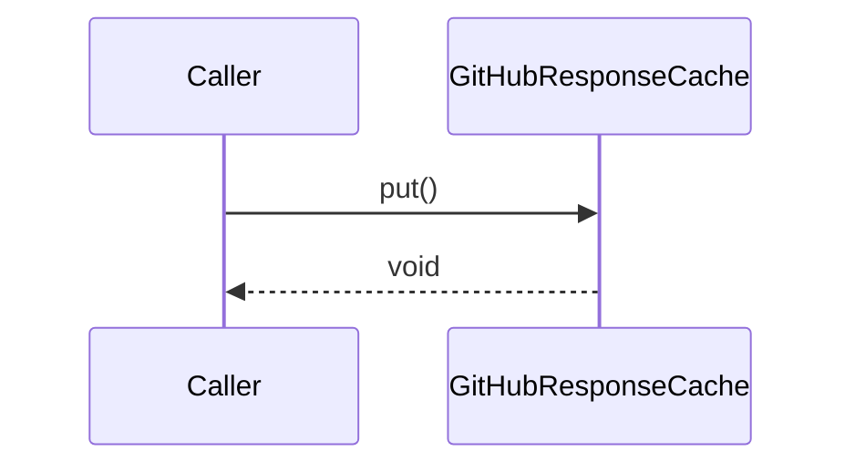
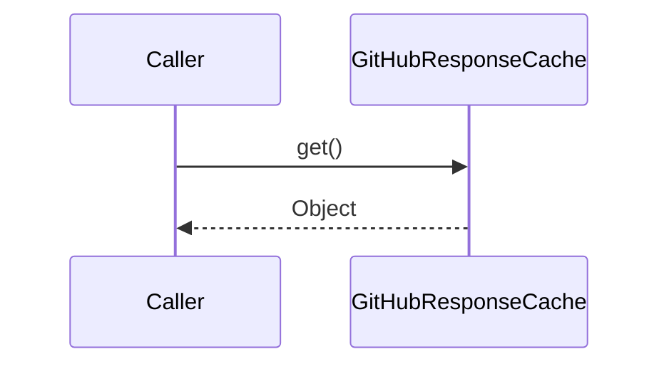
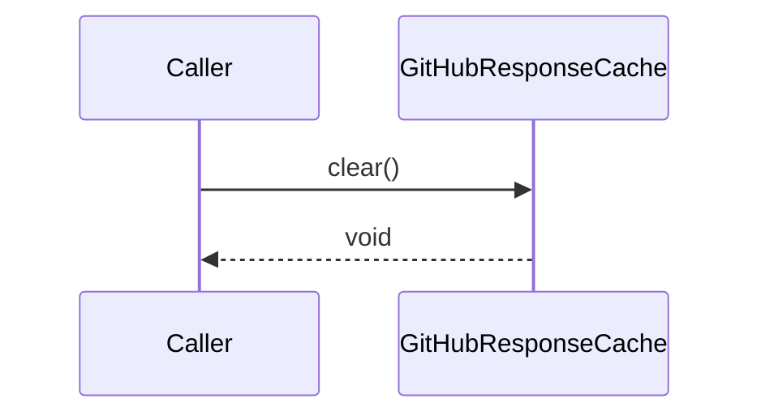
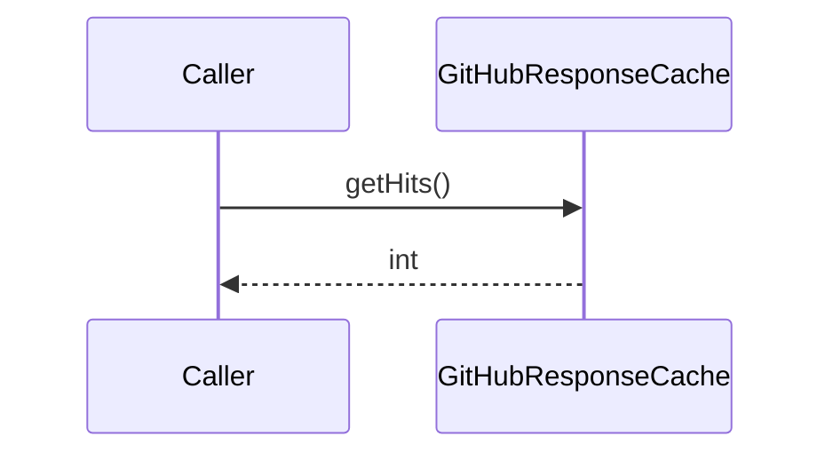

# Diagrammes de séquence

## `put`

```mermaid
sequenceDiagram
participant Caller
participant GitHubResponseCache
Caller->>GitHubResponseCache: put()
GitHubResponseCache-->>Caller: void
```

## `get`

```mermaid
sequenceDiagram
participant Caller
participant GitHubResponseCache
Caller->>GitHubResponseCache: get()
GitHubResponseCache-->>Caller: Object
```

## `clear`

```mermaid
sequenceDiagram
participant Caller
participant GitHubResponseCache
Caller->>GitHubResponseCache: clear()
GitHubResponseCache-->>Caller: void
```

## `getHits`

```mermaid
sequenceDiagram
participant Caller
participant GitHubResponseCache
Caller->>GitHubResponseCache: getHits()
GitHubResponseCache-->>Caller: int
```

## `getMisses`

```mermaid
sequenceDiagram
participant Caller
participant GitHubResponseCache
Caller->>GitHubResponseCache: getMisses()
GitHubResponseCache-->>Caller: int
```

 ⓘ *(static-analysis)*

---
