# Diagrammes de séquence

## `getUserRepositories`

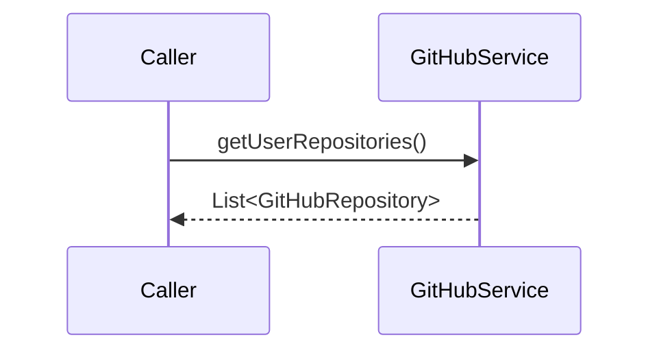

## `getAuthenticatedUserRepositories`

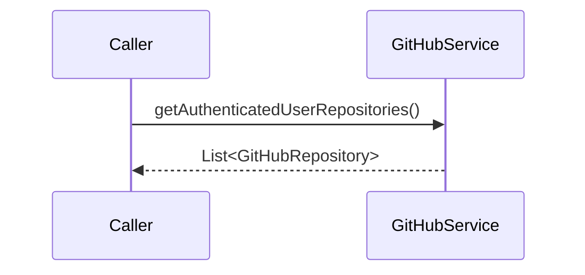

## `createRepository`


## `deleteRepository`

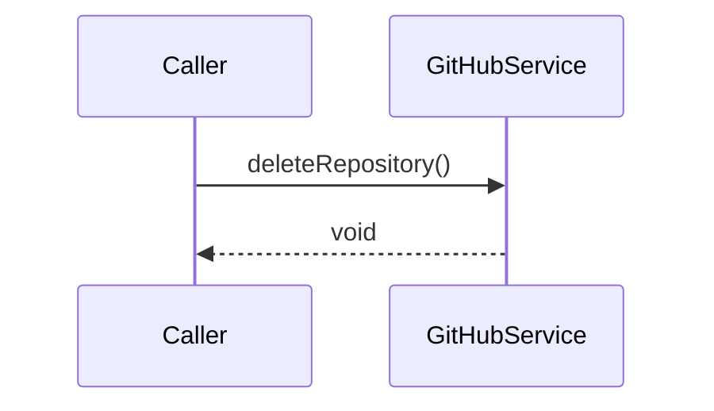

## `updateRepository`


## `getRepositoryCommits`

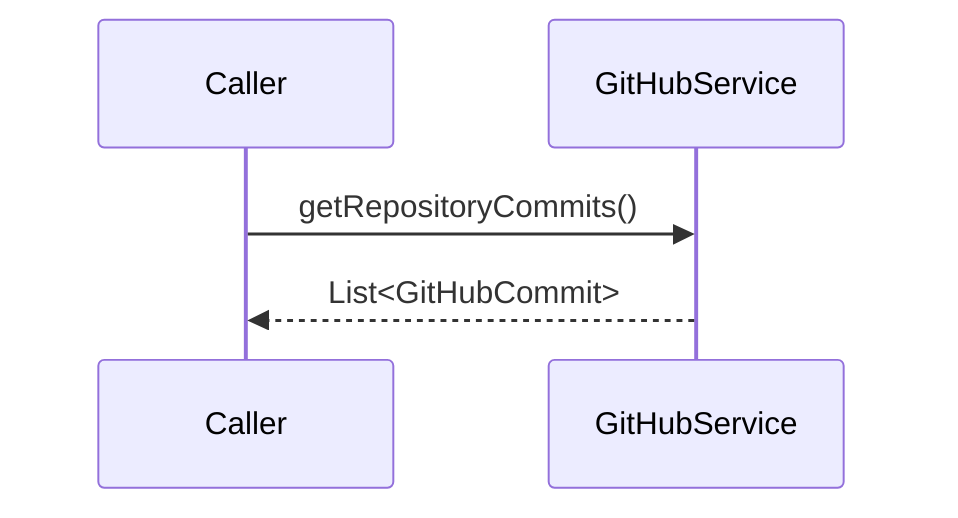

## `getRepositoryCommitsByPath`

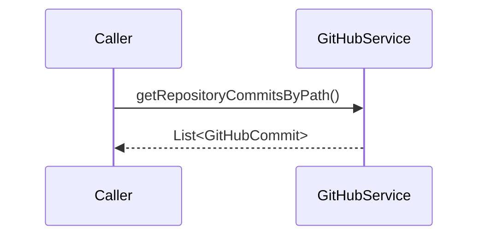

## `getLastCommit`


## `getRepositoryCollaborators`

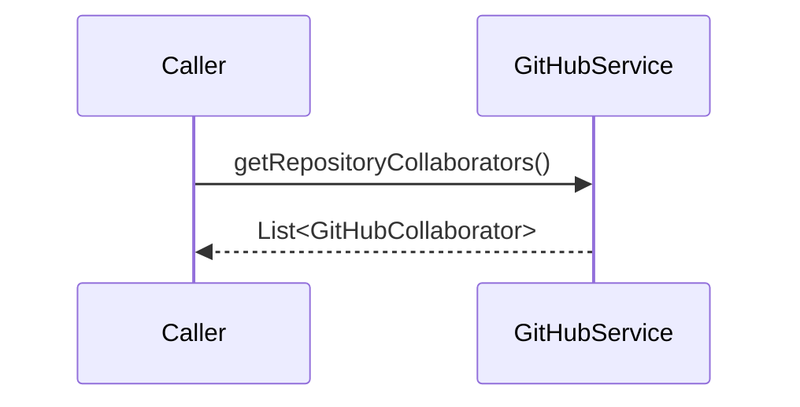

## `getRepositoryIssues`

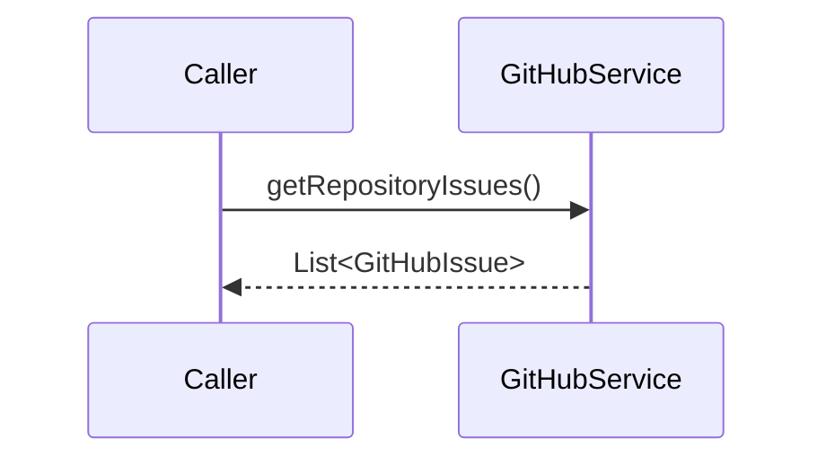

## `createIssue`

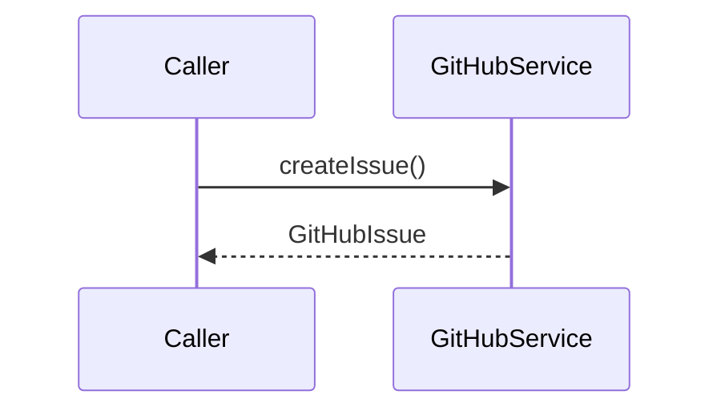

## `getRepositoryPullRequests`


## `createPullRequest`

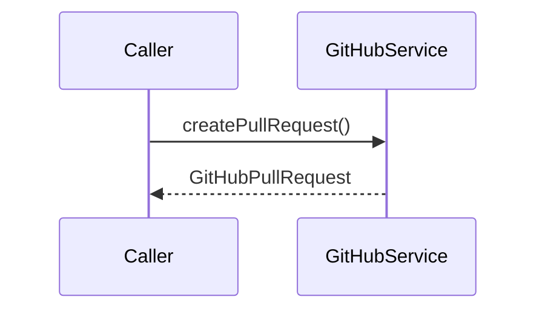

## `getRepositoryBranches`


## `createBranch`


## `deleteBranch`

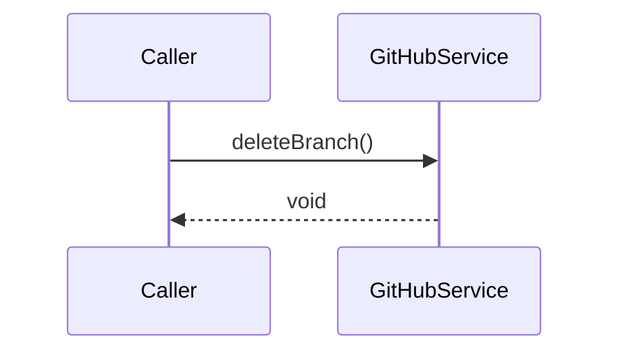

## `getUserProfile`


## `getAuthenticatedUserProfile`

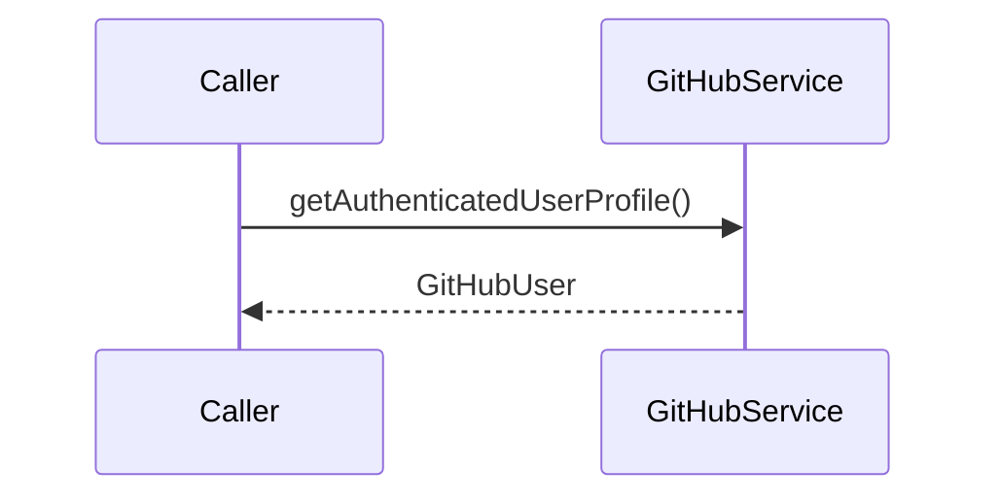

## `getRepositoryReleases`

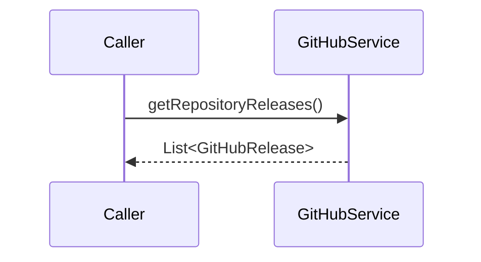

## `getLatestRelease`

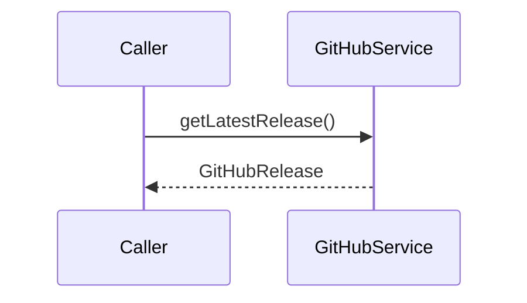

## `getWorkflowRuns`

```mermaid
sequenceDiagram
participant Caller
participant GitHubService
Caller->>GitHubService: getWorkflowRuns()
GitHubService-->>Caller: List<GitHubWorkflowRun>
```

## `getFileContent`

```mermaid
sequenceDiagram
participant Caller
participant GitHubService
Caller->>GitHubService: getFileContent()
GitHubService-->>Caller: GitHubContent
```

## `pushFileContent`

```mermaid
sequenceDiagram
participant Caller
participant GitHubService
Caller->>GitHubService: pushFileContent()
GitHubService-->>Caller: String
```

## `deleteFile`

```mermaid
sequenceDiagram
participant Caller
participant GitHubService
Caller->>GitHubService: deleteFile()
GitHubService-->>Caller: void
```

## `searchRepositories`

```mermaid
sequenceDiagram
participant Caller
participant GitHubService
Caller->>GitHubService: searchRepositories()
GitHubService-->>Caller: List<GitHubRepository>
```

## `getRepositoryForks`

```mermaid
sequenceDiagram
participant Caller
participant GitHubService
Caller->>GitHubService: getRepositoryForks()
GitHubService-->>Caller: List<GitHubFork>
```

## `forkRepository`

```mermaid
sequenceDiagram
participant Caller
participant GitHubService
Caller->>GitHubService: forkRepository()
GitHubService-->>Caller: GitHubRepository
```

## `starRepository`

```mermaid
sequenceDiagram
participant Caller
participant GitHubService
Caller->>GitHubService: starRepository()
GitHubService-->>Caller: void
```

## `unstarRepository`

```mermaid
sequenceDiagram
participant Caller
participant GitHubService
Caller->>GitHubService: unstarRepository()
GitHubService-->>Caller: void
```

## `isRepositoryStarred`

```mermaid
sequenceDiagram
participant Caller
participant GitHubService
Caller->>GitHubService: isRepositoryStarred()
GitHubService-->>Caller: boolean
```

## `hasAuthentication`

```mermaid
sequenceDiagram
participant Caller
participant GitHubService
Caller->>GitHubService: hasAuthentication()
GitHubService-->>Caller: boolean
```

## `mergePullRequest`

```mermaid
sequenceDiagram
participant Caller
participant GitHubService
Caller->>GitHubService: mergePullRequest()
GitHubService-->>Caller: void
```

 ⓘ *(static-analysis)*

---
*Généré par Antigravity MCP. Ne pas éditer manuellement.*