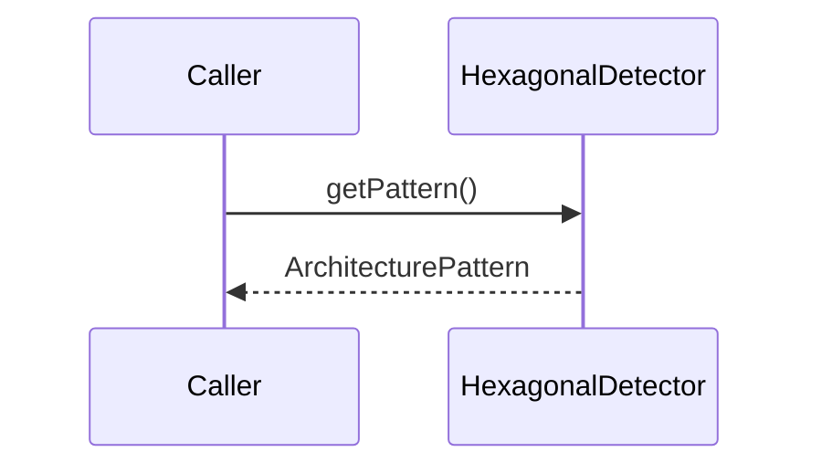
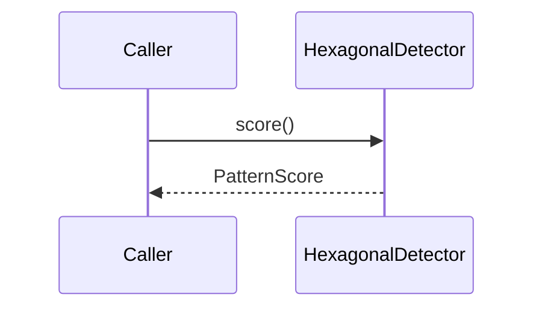

# Diagrammes de séquence

## `getPattern`

```mermaid
sequenceDiagram
participant Caller
participant HexagonalDetector
Caller->>HexagonalDetector: getPattern()
HexagonalDetector-->>Caller: ArchitecturePattern
```

## `score`

```mermaid
sequenceDiagram
participant Caller
participant HexagonalDetector
Caller->>HexagonalDetector: score()
HexagonalDetector-->>Caller: PatternScore
```

 ⓘ *(static-analysis)*

---
*Généré par Antigravity MCP. Ne pas éditer manuellement.*