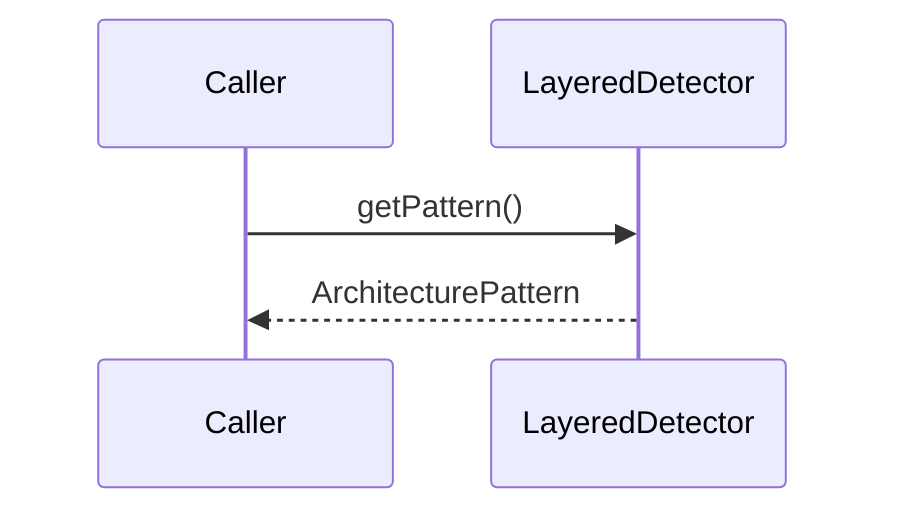
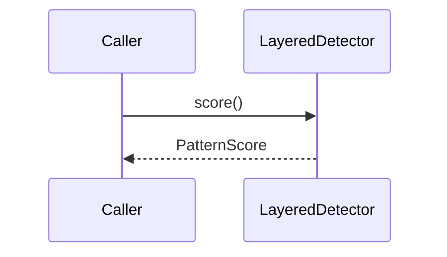

# Diagrammes de séquence

## `getPattern`

```mermaid
sequenceDiagram
participant Caller
participant LayeredDetector
Caller->>LayeredDetector: getPattern()
LayeredDetector-->>Caller: ArchitecturePattern
```

## `score`

```mermaid
sequenceDiagram
participant Caller
participant LayeredDetector
Caller->>LayeredDetector: score()
LayeredDetector-->>Caller: PatternScore
```

 ⓘ *(static-analysis)*

---
