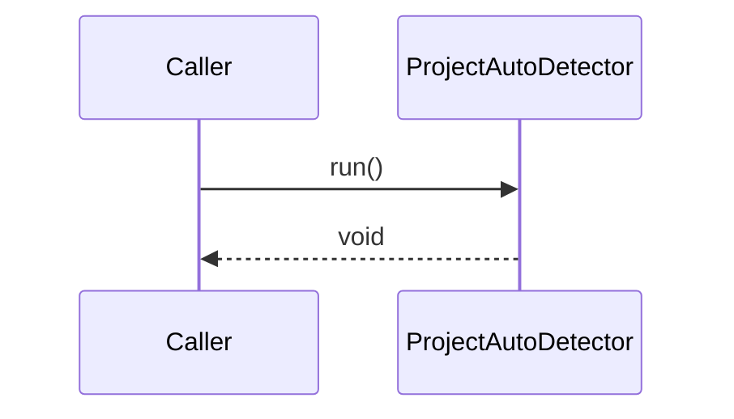

# Diagrammes de séquence

## `run`

```mermaid
sequenceDiagram
participant Caller
participant ProjectAutoDetector
Caller->>ProjectAutoDetector: run()
ProjectAutoDetector-->>Caller: void
```

 ⓘ *(static-analysis)*

---
*Généré par Antigravity MCP. Ne pas éditer manuellement.*