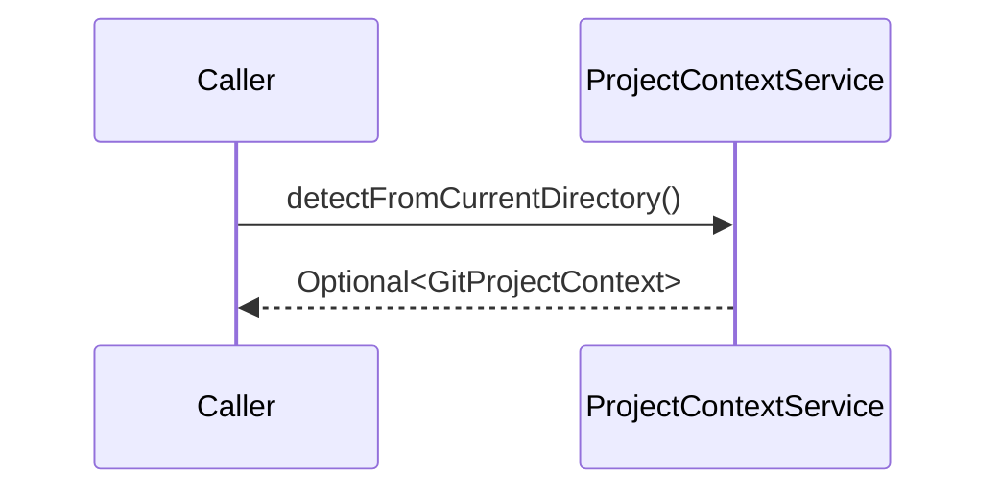
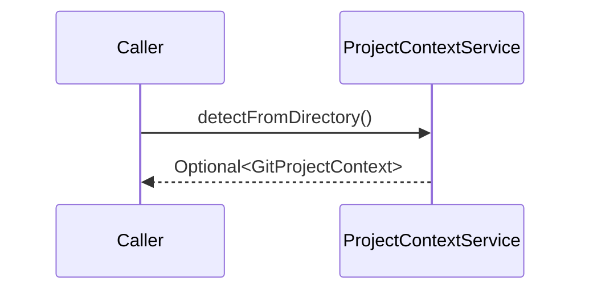

# Diagrammes de séquence

## `detectFromCurrentDirectory`

```mermaid
sequenceDiagram
participant Caller
participant ProjectContextService
Caller->>ProjectContextService: detectFromCurrentDirectory()
ProjectContextService-->>Caller: Optional<GitProjectContext>
```

## `detectFromDirectory`

```mermaid
sequenceDiagram
participant Caller
participant ProjectContextService
Caller->>ProjectContextService: detectFromDirectory()
ProjectContextService-->>Caller: Optional<GitProjectContext>
```

 ⓘ *(static-analysis)*

---
*Généré par Antigravity MCP. Ne pas éditer manuellement.*