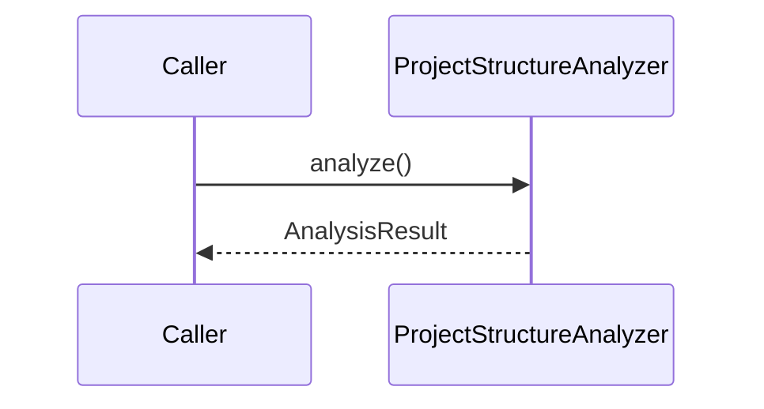

# Diagrammes de séquence

## `analyze`

```mermaid
sequenceDiagram
participant Caller
participant ProjectStructureAnalyzer
Caller->>ProjectStructureAnalyzer: analyze()
ProjectStructureAnalyzer-->>Caller: AnalysisResult
```

 ⓘ *(static-analysis)*

---
