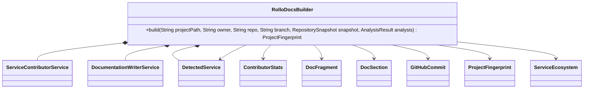

# Diagramme de classes

```mermaid
classDiagram
class RolloDocsBuilder {
  +build(String projectPath, String owner, String repo, String branch, RepositorySnapshot snapshot, AnalysisResult analysis) ProjectFingerprint
}
RolloDocsBuilder *-- ServiceContributorService
RolloDocsBuilder *-- DocumentationWriterService
RolloDocsBuilder *-- DetectedService
RolloDocsBuilder --> ContributorStats
RolloDocsBuilder --> DetectedService
RolloDocsBuilder --> DocFragment
RolloDocsBuilder --> DocSection
RolloDocsBuilder --> GitHubCommit
RolloDocsBuilder --> ProjectFingerprint
RolloDocsBuilder --> ServiceEcosystem
```

---
*Généré par Antigravity MCP. Ne pas éditer manuellement.*