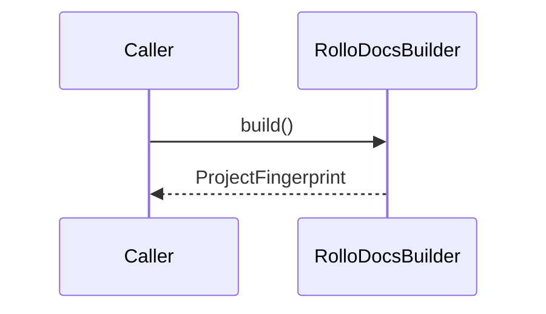

# Diagrammes de séquence

## `build`

```mermaid
sequenceDiagram
participant Caller
participant RolloDocsBuilder
Caller->>RolloDocsBuilder: build()
RolloDocsBuilder-->>Caller: ProjectFingerprint
```

 ⓘ *(static-analysis)*

---
