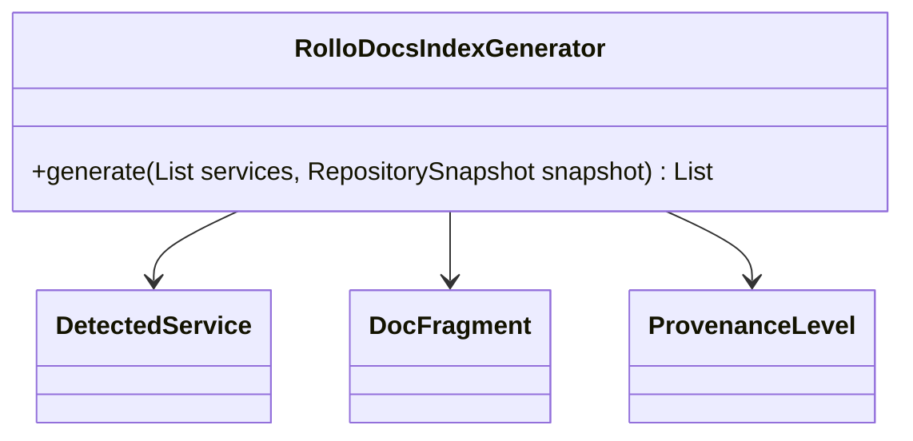

# Diagramme de classes

```mermaid
classDiagram
class RolloDocsIndexGenerator {
  +generate(List<DetectedService> services, RepositorySnapshot snapshot) List<DocFragment>
}
RolloDocsIndexGenerator --> DetectedService
RolloDocsIndexGenerator --> DocFragment
RolloDocsIndexGenerator --> ProvenanceLevel
```

---
