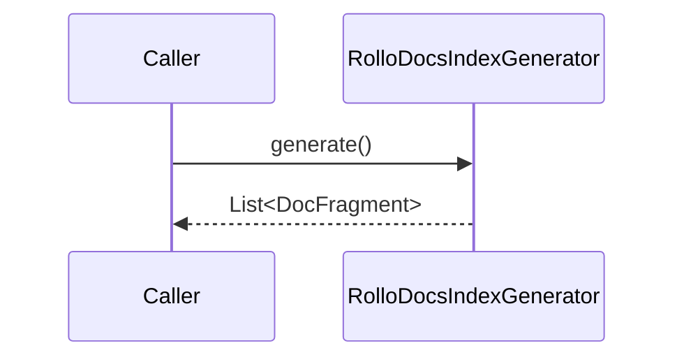

# Diagrammes de séquence

## `generate`

```mermaid
sequenceDiagram
participant Caller
participant RolloDocsIndexGenerator
Caller->>RolloDocsIndexGenerator: generate()
RolloDocsIndexGenerator-->>Caller: List<DocFragment>
```

 ⓘ *(static-analysis)*

---
