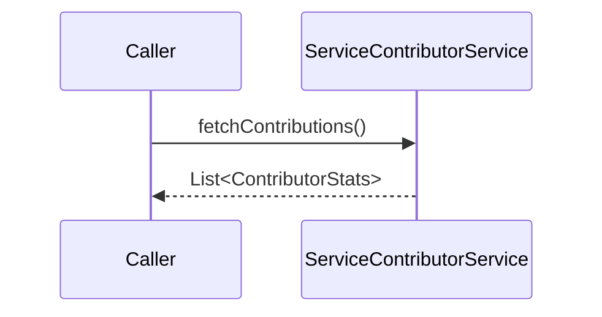
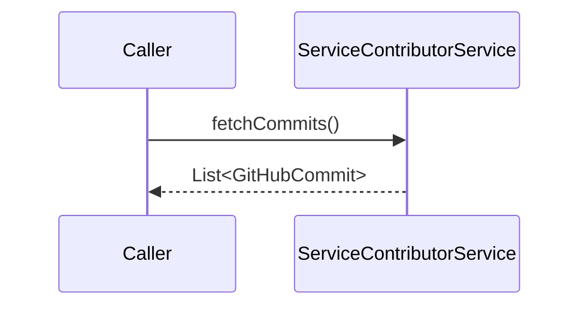

# Diagrammes de séquence

## `fetchContributions`

```mermaid
sequenceDiagram
participant Caller
participant ServiceContributorService
Caller->>ServiceContributorService: fetchContributions()
ServiceContributorService-->>Caller: List<ContributorStats>
```

## `fetchCommits`

```mermaid
sequenceDiagram
participant Caller
participant ServiceContributorService
Caller->>ServiceContributorService: fetchCommits()
ServiceContributorService-->>Caller: List<GitHubCommit>
```

 ⓘ *(static-analysis)*

---
