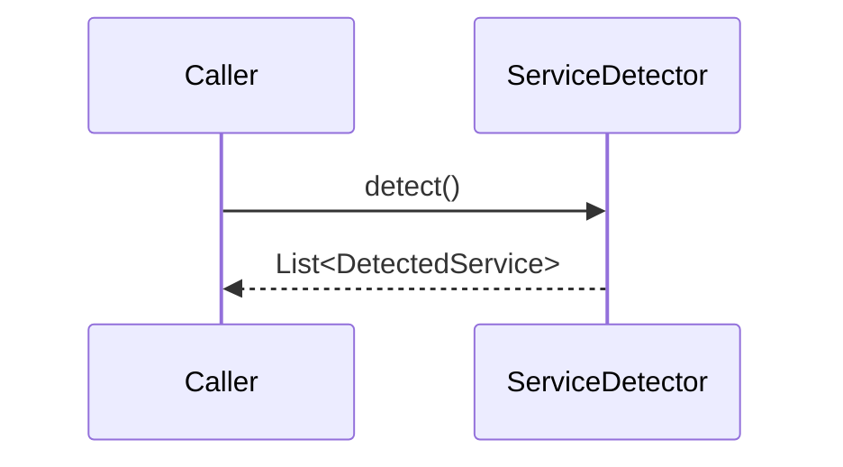

# Diagrammes de séquence

## `detect`

```mermaid
sequenceDiagram
participant Caller
participant ServiceDetector
Caller->>ServiceDetector: detect()
ServiceDetector-->>Caller: List<DetectedService>
```

 ⓘ *(static-analysis)*

---
