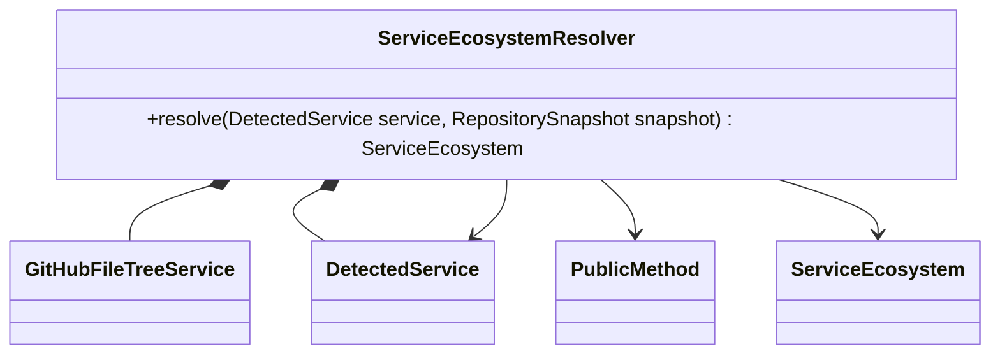

# Diagramme de classes

```mermaid
classDiagram
class ServiceEcosystemResolver {
  +resolve(DetectedService service, RepositorySnapshot snapshot) ServiceEcosystem
}
ServiceEcosystemResolver *-- GitHubFileTreeService
ServiceEcosystemResolver *-- DetectedService
ServiceEcosystemResolver --> DetectedService
ServiceEcosystemResolver --> PublicMethod
ServiceEcosystemResolver --> ServiceEcosystem
```

---
