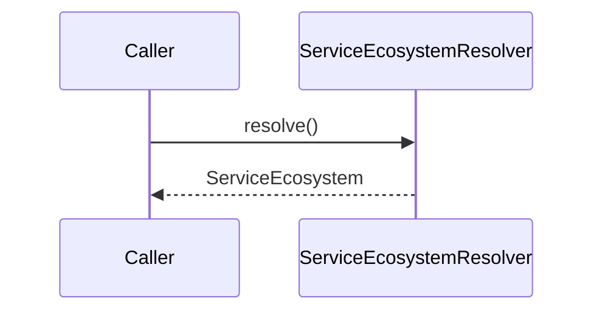

# Diagrammes de séquence

## `resolve`

```mermaid
sequenceDiagram
participant Caller
participant ServiceEcosystemResolver
Caller->>ServiceEcosystemResolver: resolve()
ServiceEcosystemResolver-->>Caller: ServiceEcosystem
```

 ⓘ *(static-analysis)*

---
*Généré par Antigravity MCP. Ne pas éditer manuellement.*