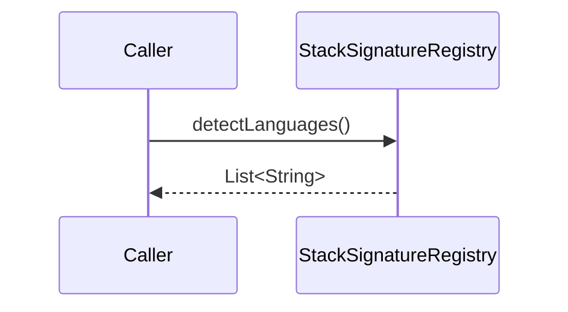
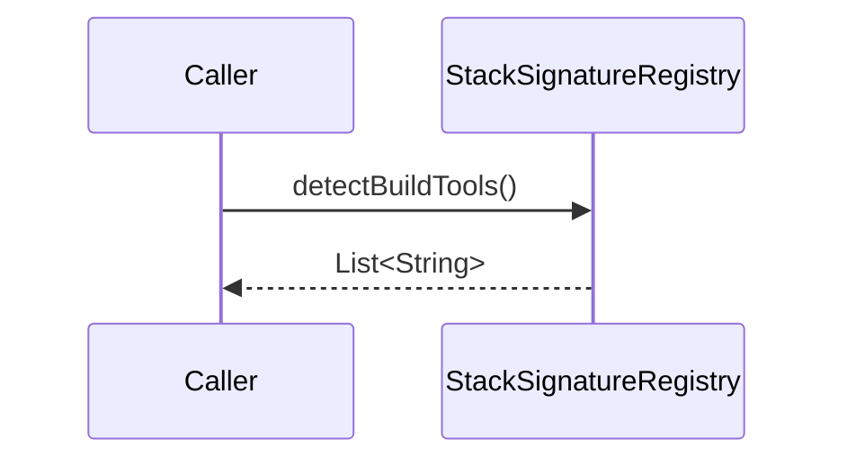
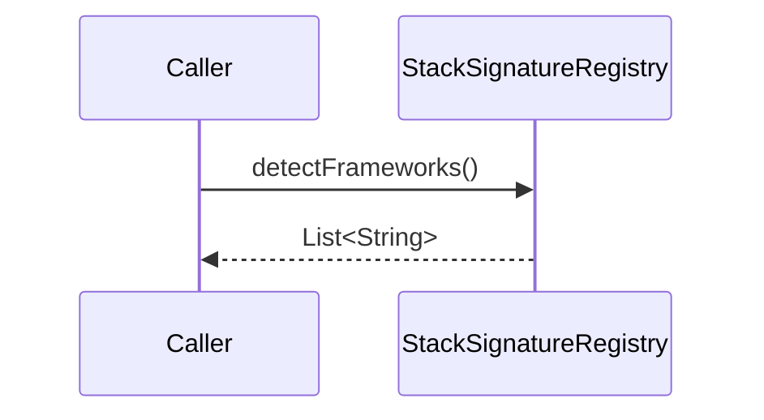

# Diagrammes de séquence

## `detectLanguages`

```mermaid
sequenceDiagram
participant Caller
participant StackSignatureRegistry
Caller->>StackSignatureRegistry: detectLanguages()
StackSignatureRegistry-->>Caller: List<String>
```

## `detectBuildTools`

```mermaid
sequenceDiagram
participant Caller
participant StackSignatureRegistry
Caller->>StackSignatureRegistry: detectBuildTools()
StackSignatureRegistry-->>Caller: List<String>
```

## `detectFrameworks`

```mermaid
sequenceDiagram
participant Caller
participant StackSignatureRegistry
Caller->>StackSignatureRegistry: detectFrameworks()
StackSignatureRegistry-->>Caller: List<String>
```

 ⓘ *(static-analysis)*

---
