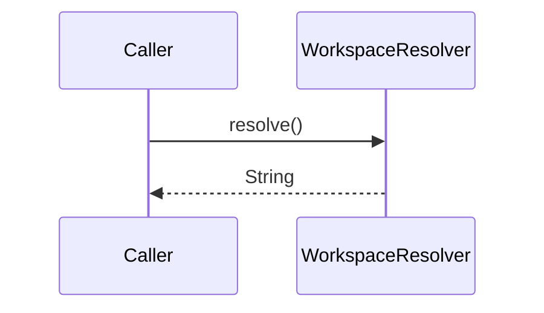

# Diagrammes de séquence

## `resolve`

```mermaid
sequenceDiagram
participant Caller
participant WorkspaceResolver
Caller->>WorkspaceResolver: resolve()
WorkspaceResolver-->>Caller: String
```

 ⓘ *(static-analysis)*

---
